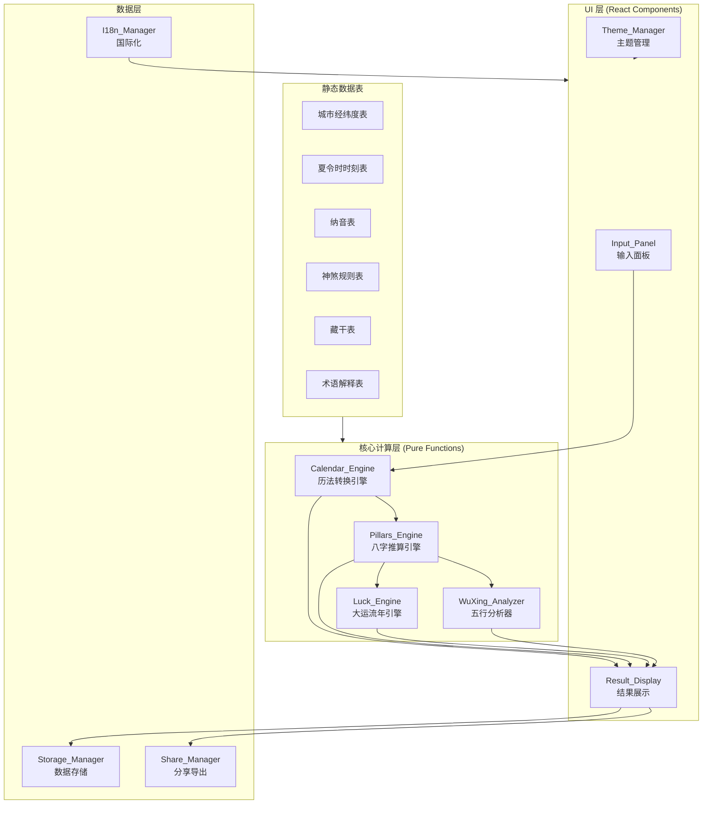
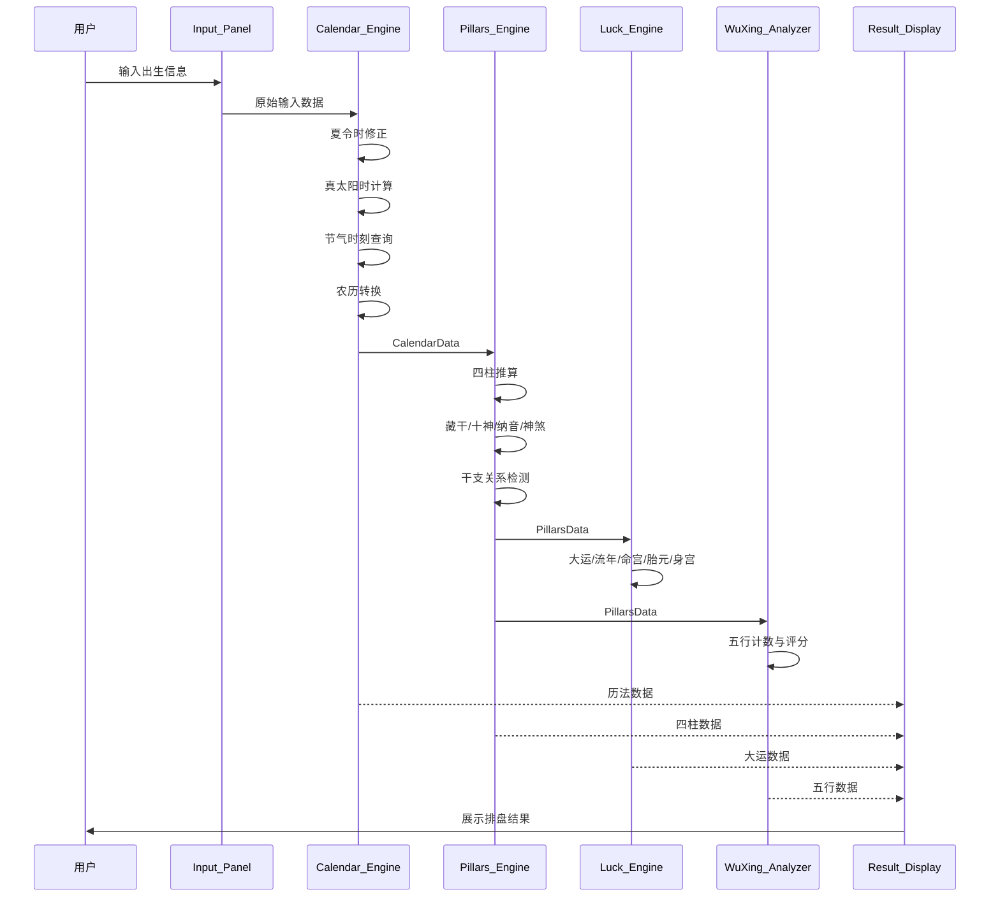

# Design Document: 八字排盘系统 (BaZi Calculator)

## Overview

本系统是一个纯前端在线八字排盘（BaZi / Four Pillars of Destiny）应用，基于 React 18 + TypeScript + Vite + Tailwind CSS 构建。所有天文历法计算和命理推算均在浏览器端完成，零后端依赖，使用 localStorage 持久化数据，部署到 GitHub Pages。

系统核心流程：用户输入出生信息 → 历法转换（节气、真太阳时、农历） → 四柱推算 → 命理分析（十神、纳音、神煞、干支关系） → 大运流年 → 五行分析 → 结果展示。

### 设计原则

- **计算精度优先**：节气计算基于天文算法，精度 < 1 分钟
- **纯函数设计**：核心计算引擎为纯函数，无副作用，便于测试
- **模块化解耦**：历法引擎、推算引擎、UI 层严格分离
- **数据驱动**：天干地支关系、纳音表、神煞规则等均以数据表形式维护

## Architecture

### 整体架构



### 数据流



### 目录结构

```
src/
├── components/          # React UI 组件
│   ├── InputPanel/      # 输入面板组件
│   ├── ResultDisplay/   # 结果展示组件
│   ├── LuckDisplay/     # 大运流年展示
│   ├── WuXingChart/     # 五行图表
│   └── common/          # 通用组件（Tooltip、Modal等）
├── core/                # 核心计算引擎（纯函数）
│   ├── calendar/        # 历法转换引擎
│   │   ├── solarTerms.ts    # 节气计算
│   │   ├── trueSolarTime.ts # 真太阳时
│   │   ├── lunarCalendar.ts # 农历转换
│   │   └── dst.ts           # 夏令时处理
│   ├── pillars/         # 八字推算引擎
│   │   ├── yearPillar.ts    # 年柱
│   │   ├── monthPillar.ts   # 月柱
│   │   ├── dayPillar.ts     # 日柱
│   │   ├── hourPillar.ts    # 时柱
│   │   ├── hiddenStems.ts   # 藏干
│   │   ├── tenGods.ts       # 十神
│   │   ├── naYin.ts         # 纳音
│   │   ├── shenSha.ts       # 神煞
│   │   └── relations.ts     # 干支关系
│   ├── luck/            # 大运流年引擎
│   │   ├── daYun.ts         # 大运计算
│   │   ├── liuNian.ts       # 流年计算
│   │   └── palaces.ts       # 命宫/胎元/身宫
│   └── wuxing/          # 五行分析
│       └── analyzer.ts      # 五行计数与评分
├── data/                # 静态数据表
│   ├── cities.ts            # 城市经纬度
│   ├── dst.ts               # 夏令时时刻表
│   ├── naYinTable.ts        # 纳音表
│   ├── shenShaRules.ts      # 神煞规则
│   ├── hiddenStemsTable.ts  # 藏干表
│   └── glossary.ts          # 术语解释
├── i18n/                # 国际化
│   ├── zh.ts
│   └── en.ts
├── store/               # 状态管理
│   └── useStore.ts          # Zustand store
├── utils/               # 工具函数
│   ├── storage.ts           # localStorage 封装
│   ├── share.ts             # URL 编解码
│   └── export.ts            # 图片/打印导出
├── types/               # TypeScript 类型定义
│   └── index.ts
├── App.tsx
└── main.tsx
```

## Components and Interfaces

### 1. Calendar_Engine（历法转换引擎）

```typescript
// 节气计算模块
function getSolarTermMoment(year: number, termIndex: number): Date;
function getAllSolarTerms(year: number): SolarTerm[];
function findPrevNextJieQi(date: Date): { prev: SolarTerm; next: SolarTerm };

// 真太阳时计算模块
function calculateEoT(dayOfYear: number): number; // 返回分钟
function calculateTrueSolarTime(
  standardTime: Date,
  longitude: number
): TrueSolarTimeResult;

// 农历转换模块
function solarToLunar(date: Date): LunarDate;
function lunarToSolar(lunarDate: LunarDate): Date;
function getLeapMonth(year: number): number; // 0 表示无闰月

// 夏令时处理模块
function isDSTActive(date: Date): boolean;
function applyDSTCorrection(date: Date, userConfirmedDST: boolean): Date;
```

### 2. Pillars_Engine（八字推算引擎）

```typescript
// 四柱推算
function calculateYearPillar(trueSolarTime: Date, solarTerms: SolarTerm[]): Pillar;
function calculateMonthPillar(trueSolarTime: Date, yearStem: HeavenlyStem, solarTerms: SolarTerm[]): Pillar;
function calculateDayPillar(trueSolarTime: Date, earlyRatSplit: boolean): Pillar;
function calculateHourPillar(trueSolarTime: Date, dayStem: HeavenlyStem): Pillar;
function calculateFourPillars(input: CalendarData): FourPillars;

// 藏干
function getHiddenStems(branch: EarthlyBranch): HiddenStem[];

// 十神
function calculateTenGod(dayStem: HeavenlyStem, targetStem: HeavenlyStem): TenGod;

// 纳音
function getNaYin(pillar: Pillar): NaYinResult;

// 神煞
function calculateShenSha(fourPillars: FourPillars): ShenShaResult[];

// 干支关系
function detectBranchRelations(branches: EarthlyBranch[]): BranchRelation[];
function detectStemRelations(stems: HeavenlyStem[]): StemRelation[];
```

### 3. Luck_Engine（大运流年引擎）

```typescript
function calculateDaYunDirection(
  yearStem: HeavenlyStem,
  gender: Gender
): 'forward' | 'backward';

function calculateStartAge(
  birthTime: Date,
  monthPillar: Pillar,
  direction: 'forward' | 'backward',
  solarTerms: SolarTerm[]
): DaYunStartAge;

function calculateDaYun(
  monthPillar: Pillar,
  direction: 'forward' | 'backward',
  steps: number
): DaYunStep[];

function calculateLiuNian(startYear: number, count: number): LiuNianEntry[];

function calculateMingGong(monthPillar: Pillar, hourBranch: EarthlyBranch): Pillar;
function calculateTaiYuan(monthPillar: Pillar): Pillar;
function calculateShenGong(monthPillar: Pillar, hourBranch: EarthlyBranch): Pillar;
```

### 4. WuXing_Analyzer（五行分析器）

```typescript
function countWuXing(fourPillars: FourPillars): WuXingCount;

function calculateWuXingScore(
  fourPillars: FourPillars,
  weights: WuXingWeights
): WuXingScore;

function judgeDayMasterStrength(
  fourPillars: FourPillars,
  monthBranch: EarthlyBranch,
  wuxingScore: WuXingScore
): DayMasterStrength;
```

### 5. Storage_Manager（数据存储管理器）

```typescript
function saveRecord(record: BaZiRecord): void;
function getRecords(): BaZiRecord[];
function deleteRecord(id: string): void;
function clearRecords(): void;
function savePreferences(prefs: UserPreferences): void;
function getPreferences(): UserPreferences;
function exportData(): ExportData;
function importData(json: string): ImportResult;
```

### 6. Share_Manager（分享导出管理器）

```typescript
function encodeToHash(params: BaZiInput): string;
function decodeFromHash(hash: string): BaZiInput | null;
function exportAsImage(elementId: string): Promise<Blob>;
function triggerPrint(): void;
```

### 7. I18n_Manager（国际化管理器）

```typescript
function t(key: string): string;
function setLocale(locale: 'zh' | 'en'): void;
function getLocale(): 'zh' | 'en';
```


## Data Models

### 基础类型

```typescript
// 天干
type HeavenlyStem = '甲' | '乙' | '丙' | '丁' | '戊' | '己' | '庚' | '辛' | '壬' | '癸';

// 地支
type EarthlyBranch = '子' | '丑' | '寅' | '卯' | '辰' | '巳' | '午' | '未' | '申' | '酉' | '戌' | '亥';

// 五行
type WuXing = '金' | '木' | '水' | '火' | '土';

// 十神
type TenGod = '比肩' | '劫财' | '食神' | '伤官' | '偏财' | '正财' | '偏官' | '正官' | '偏印' | '正印';

// 性别
type Gender = 'male' | 'female';

// 语言
type Locale = 'zh' | 'en';

// 主题
type Theme = 'light' | 'dark';
```

### 核心数据结构

```typescript
// 干支柱
interface Pillar {
  stem: HeavenlyStem;
  branch: EarthlyBranch;
}

// 藏干
interface HiddenStem {
  stem: HeavenlyStem;
  type: 'main' | 'middle' | 'residual'; // 本气 | 中气 | 余气
  weight: number; // 权重（用于五行力量计算）
}

// 节气
interface SolarTerm {
  name: string;
  index: number;       // 0-23
  moment: Date;        // 精确时刻
  longitude: number;   // 太阳黄经度数
}

// 农历日期
interface LunarDate {
  year: number;
  month: number;
  day: number;
  isLeapMonth: boolean;
}

// 真太阳时计算结果
interface TrueSolarTimeResult {
  originalTime: Date;
  trueSolarTime: Date;
  longitudeDiff: number;   // 经度时差（分钟）
  eotCorrection: number;   // EoT 修正值（分钟）
}

// 四柱
interface FourPillars {
  year: Pillar;
  month: Pillar;
  day: Pillar;
  hour: Pillar;
}

// 纳音结果
interface NaYinResult {
  name: string;      // 如 "海中金"
  wuxing: WuXing;    // 对应五行
}

// 神煞结果
interface ShenShaResult {
  name: string;          // 神煞名称
  pillarPosition: 'year' | 'month' | 'day' | 'hour';
  description: string;
}

// 地支关系
interface BranchRelation {
  type: 'sixCombine' | 'threeHarmony' | 'threeAssembly' | 'sixClash' | 'sixHarm' | 'threePunish' | 'destruction';
  branches: EarthlyBranch[];
  positions: ('year' | 'month' | 'day' | 'hour')[];
  description: string;
}

// 天干关系
interface StemRelation {
  type: 'fiveCombine' | 'clash';
  stems: HeavenlyStem[];
  positions: ('year' | 'month' | 'day' | 'hour')[];
}

// 大运步
interface DaYunStep {
  pillar: Pillar;
  startAge: number;
  endAge: number;
}

// 大运起运年龄
interface DaYunStartAge {
  years: number;
  months: number;
  days: number;
}

// 流年条目
interface LiuNianEntry {
  year: number;
  pillar: Pillar;
}

// 五行计数
interface WuXingCount {
  metal: number;   // 金
  wood: number;    // 木
  water: number;   // 水
  fire: number;    // 火
  earth: number;   // 土
}

// 五行力量评分
interface WuXingScore {
  metal: number;
  wood: number;
  water: number;
  fire: number;
  earth: number;
  total: number;
}

// 五行权重配置
interface WuXingWeights {
  heavenlyStem: number;     // 天干权重，如 1.0
  mainQi: number;           // 本气权重，如 0.7
  middleQi: number;         // 中气权重，如 0.3
  residualQi: number;       // 余气权重，如 0.1
}

// 日主旺衰
interface DayMasterStrength {
  status: 'strong' | 'weak' | 'neutral';
  score: number;
  analysis: string;
}
```

### 输入/输出数据结构

```typescript
// 用户输入
interface BaZiInput {
  dateType: 'solar' | 'lunar';
  year: number;
  month: number;
  day: number;
  isLeapMonth?: boolean;    // 仅农历模式
  hour: number;
  minute: number;
  timeType: 'standard' | 'trueSolar';
  gender: Gender;
  longitude: number;
  cityCode?: string;
  dstConfirmed?: boolean;   // 夏令时确认
  earlyRatSplit: boolean;   // 早子时/晚子时分属不同日柱
}

// 排盘完整结果
interface BaZiResult {
  input: BaZiInput;
  calendarData: {
    solarDate: Date;
    lunarDate: LunarDate;
    trueSolarTime: TrueSolarTimeResult;
    relevantSolarTerms: SolarTerm[];
  };
  fourPillars: FourPillars;
  hiddenStems: Record<'year' | 'month' | 'day' | 'hour', HiddenStem[]>;
  tenGods: Record<string, TenGod>;  // key: 位置标识
  naYin: Record<'year' | 'month' | 'day' | 'hour', NaYinResult>;
  shenSha: ShenShaResult[];
  branchRelations: BranchRelation[];
  stemRelations: StemRelation[];
  luck: {
    direction: 'forward' | 'backward';
    startAge: DaYunStartAge;
    daYun: DaYunStep[];
    currentLiuNian: LiuNianEntry[];
  };
  palaces: {
    mingGong: Pillar;   // 命宫
    taiYuan: Pillar;    // 胎元
    shenGong: Pillar;   // 身宫
  };
  wuxing: {
    count: WuXingCount;
    score: WuXingScore;
    dayMasterStrength: DayMasterStrength;
  };
}

// 历史记录
interface BaZiRecord {
  id: string;
  timestamp: number;
  input: BaZiInput;
  result: BaZiResult;
  label?: string;
}

// 用户偏好
interface UserPreferences {
  theme: Theme;
  locale: Locale;
  earlyRatSplit: boolean;
  defaultCityCode?: string;
  defaultLongitude?: number;
}

// 导出数据
interface ExportData {
  version: string;
  exportTime: number;
  records: BaZiRecord[];
  preferences: UserPreferences;
}

// 导入结果
interface ImportResult {
  success: boolean;
  error?: string;
  recordCount?: number;
}
```

### 静态数据表结构

```typescript
// 城市数据
interface CityData {
  code: string;
  province: string;
  city: string;
  district?: string;
  longitude: number;
  latitude: number;
}

// 夏令时时刻表条目
interface DSTEntry {
  year: number;
  start: Date;  // 夏令时开始时刻
  end: Date;    // 夏令时结束时刻
}

// 纳音表条目（60甲子 → 纳音名称）
type NaYinTable = Record<string, NaYinResult>; // key: "甲子" | "乙丑" | ...

// 藏干表
type HiddenStemsTable = Record<EarthlyBranch, HiddenStem[]>;

// 术语解释
interface GlossaryEntry {
  key: string;
  zh: string;
  en: string;
  description_zh: string;
  description_en: string;
}
```


## Correctness Properties

*A property is a characteristic or behavior that should hold true across all valid executions of a system—essentially, a formal statement about what the system should do. Properties serve as the bridge between human-readable specifications and machine-verifiable correctness guarantees.*

### Property 1: 年份范围验证

*For any* 年份值，当且仅当该值在 1900-2100 范围内时，输入验证函数应返回有效；范围外的年份应被拒绝。

**Validates: Requirements 1.3, 1.5**

### Property 2: 经度范围验证

*For any* 经度值，当且仅当该值在 [-180, 180] 范围内时，输入验证函数应返回有效；范围外的值应被拒绝。

**Validates: Requirements 4.4**

### Property 3: 城市经度自动填充

*For any* 城市数据库中的城市，选择该城市后返回的经度值应与数据库中存储的经度值一致。

**Validates: Requirements 4.2**

### Property 4: 夏令时检测与修正

*For any* 1986-1991 年间的日期时间，`isDSTActive` 函数应正确判断该时刻是否处于夏令时生效期间；当用户确认包含夏令时时，`applyDSTCorrection` 应将时间减去恰好 1 小时。

**Validates: Requirements 5.1, 5.3, 10.2**

### Property 5: 真太阳时计算正确性

*For any* 有效的北京标准时间、经度和日期组合，真太阳时计算结果应满足：trueSolarTime = standardTime + (longitude - 120) × 4分钟 + EoT(date)，且结果对象应同时包含原始输入时间和转换后的真太阳时。

**Validates: Requirements 2.3, 8.1, 8.2, 8.3, 8.4**

### Property 6: 节气覆盖完整性

*For any* 1900-2100 范围内的年份，节气计算应返回恰好 24 个节气时刻，且每个时刻应精确到秒。

**Validates: Requirements 7.2, 7.4**

### Property 7: 农历公历往返一致性

*For any* 1900-2100 范围内的有效公历日期，`solarToLunar` 转换为农历后再通过 `lunarToSolar` 转回公历，应得到与原始日期相同的结果。

**Validates: Requirements 9.1, 9.2, 9.4**

### Property 8: 农历闰月显示正确性

*For any* 存在闰月的农历年份，农历月份列表应包含该闰月的标识，且闰月与同名非闰月应被区分。

**Validates: Requirements 1.4, 9.3**

### Property 9: 年柱立春分界

*For any* 出生时间，年柱应由立春精确时刻决定：立春之前取上一年干支，立春及之后取当年干支。即对于任意年份 Y 的立春时刻 T，时刻 T-1秒 的年柱应对应 Y-1 年，时刻 T 的年柱应对应 Y 年。

**Validates: Requirements 11.1, 11.2, 11.3**

### Property 10: 月柱推算正确性

*For any* 出生时间和年干组合，月柱地支应由该时刻所处的"节"区间决定，月柱天干应符合五虎遁月口诀的映射规则。

**Validates: Requirements 12.1, 12.2, 12.3**

### Property 11: 日柱推算正确性

*For any* 日期，以 1900-01-31（甲子日）为基准，日柱干支应等于 (julianDayDiff mod 60) 对应的六十甲子序号。当启用早子时分属选项时，23:00-23:59 的日柱应属于下一日。

**Validates: Requirements 13.1, 13.2, 13.3**

### Property 12: 时柱推算正确性

*For any* 真太阳时（0:00-23:59）和日干组合，时柱地支应由时辰映射表决定（每两小时一个时辰），时柱天干应符合五鼠遁时口诀的映射规则。

**Validates: Requirements 14.1, 14.2**

### Property 13: 藏干查表正确性

*For any* 十二地支，`getHiddenStems` 返回的藏干列表应与标准藏干表完全一致，包含正确的本气、中气、余气分类和权重。

**Validates: Requirements 15.1**

### Property 14: 十神推算正确性

*For any* 日干和目标天干的组合（共 10×10=100 种），十神推算结果应由五行生克关系和阴阳属性唯一确定，且正确区分正/偏（如正印 vs 偏印）。

**Validates: Requirements 16.1, 16.2**

### Property 15: 纳音查表正确性

*For any* 六十甲子中的干支对，`getNaYin` 返回的纳音名称和五行应与标准纳音表一致。

**Validates: Requirements 17.1**

### Property 16: 神煞推算确定性

*For any* 四柱组合，神煞推算应根据标准规则表产生确定性结果，且覆盖天乙贵人、文昌、驿马、桃花、华盖、将星、空亡、羊刃、禄神全部 9 种神煞。

**Validates: Requirements 18.1**

### Property 17: 地支关系检测正确性

*For any* 四个地支的组合，关系检测函数应正确识别所有存在的六合、三合、三会、六冲、六害、三刑、相破关系，且不遗漏、不误报。

**Validates: Requirements 19.1, 19.2, 19.3, 19.4, 19.5, 19.6, 19.7**

### Property 18: 天干关系检测正确性

*For any* 四个天干的组合，关系检测函数应正确识别所有存在的五合和相克关系，且不遗漏、不误报。

**Validates: Requirements 20.1, 20.2**

### Property 19: 大运顺逆排方向

*For any* 性别和年干组合，大运方向应满足：阳年干+男性=顺排，阴年干+男性=逆排，阳年干+女性=逆排，阴年干+女性=顺排。

**Validates: Requirements 21.1**

### Property 20: 大运序列正确性

*For any* 月柱和排列方向，大运序列应从月柱出发，按六十甲子顺序（顺排）或逆序（逆排）排列 8-9 步，每步间隔恰好为六十甲子中的相邻干支。

**Validates: Requirements 21.3**

### Property 21: 流年干支循环

*For any* 起始年份和数量，流年干支应严格按照六十甲子循环排列，即 year 对应的干支序号 = (year - 4) mod 60。

**Validates: Requirements 22.1**

### Property 22: 命宫胎元身宫计算确定性

*For any* 月柱和时柱组合，命宫、胎元、身宫的计算结果应唯一确定。胎元天干 = 月干 + 1，胎元地支 = 月支 + 3（均在各自循环内取模）。

**Validates: Requirements 23.1, 23.2, 23.3**

### Property 23: 五行计数与评分一致性

*For any* 四柱组合和权重配置，五行计数应正确统计所有天干和藏干的五行归属，五行力量评分应等于各五行元素按权重（天干、本气、中气、余气）的加权总和。

**Validates: Requirements 24.1, 24.2**

### Property 24: 五行配色映射

*For any* 天干或地支，其对应的五行配色应与标准五行色彩映射一致（金-白/金、木-绿、水-蓝/黑、火-红、土-黄/棕）。

**Validates: Requirements 26.2**

### Property 25: 术语解释完整性

*For any* 十神名称、神煞名称或地支关系类型，术语库中应存在对应的中英文解释条目。

**Validates: Requirements 27.2, 29.2**

### Property 26: 用户偏好往返一致性

*For any* 有效的用户偏好设置（主题、语言、流派选项、默认地点），保存到 localStorage 后再读取应得到与原始设置完全一致的结果。

**Validates: Requirements 28.3, 29.4, 31.1, 31.2**

### Property 27: 历史记录上限不变量

*For any* 保存操作序列，历史记录数量应始终 ≤ 50。当达到上限时新增记录应删除最早的一条。

**Validates: Requirements 30.2, 30.3**

### Property 28: 历史记录往返一致性

*For any* 排盘结果，保存到历史记录后再加载，恢复的输入参数应与原始输入参数一致。

**Validates: Requirements 30.1, 30.4**

### Property 29: 数据导出导入往返一致性

*For any* 有效的导出数据（历史记录 + 偏好设置），导出为 JSON 后再导入应得到与原始数据一致的结果。

**Validates: Requirements 32.1, 32.2, 32.4**

### Property 30: 无效 JSON 导入拒绝

*For any* 不符合预期结构的 JSON 字符串，导入函数应返回失败结果且不修改现有数据。

**Validates: Requirements 32.3**

### Property 31: URL 参数往返一致性

*For any* 有效的排盘输入参数，编码到 URL hash 后再解码应得到与原始参数一致的结果。

**Validates: Requirements 34.1, 34.2, 34.3**


## Error Handling

### 输入验证错误

| 错误场景 | 处理方式 |
|---------|---------|
| 年份超出 1900-2100 范围 | 禁用提交按钮，显示"日期超出支持范围"提示 |
| 经度超出 [-180, 180] 范围 | 显示"经度值无效"提示，禁用提交 |
| 农历日期无效（如不存在的闰月日期） | 显示"日期无效"提示，禁用提交 |
| 必填字段为空 | 高亮未填字段，禁用提交 |

### 计算错误

| 错误场景 | 处理方式 |
|---------|---------|
| 节气数据缺失 | 回退到近似计算，在结果中标注精度降级 |
| 农历转换失败 | 显示错误提示，建议用户切换到公历输入 |

### 数据存储错误

| 错误场景 | 处理方式 |
|---------|---------|
| localStorage 不可用或已满 | 显示提示，建议清理历史记录或导出数据 |
| JSON 导入格式无效 | 显示"文件格式无效"提示，拒绝导入，不修改现有数据 |
| JSON 导入数据损坏 | 跳过损坏的记录，导入有效部分，显示部分导入提示 |
| URL hash 解析失败 | 忽略无效参数，显示空白输入面板 |

### 分享导出错误

| 错误场景 | 处理方式 |
|---------|---------|
| 图片导出 canvas 渲染失败 | 显示错误提示，建议使用浏览器截图功能 |
| 剪贴板 API 不可用 | 回退到选中文本方式，提示用户手动复制 |

### 错误处理原则

- 所有核心计算函数为纯函数，通过 TypeScript 类型系统和输入验证在调用前排除无效输入
- UI 层使用 React Error Boundary 捕获渲染错误，显示友好的错误回退界面
- 所有 localStorage 操作使用 try-catch 包裹，优雅降级
- 用户可见的错误信息支持中英双语

## Testing Strategy

### 测试框架选择

- **单元测试**: Vitest（与 Vite 原生集成）
- **属性测试**: fast-check（JavaScript/TypeScript 生态最成熟的属性测试库）
- **组件测试**: React Testing Library + Vitest
- **E2E 测试**: 可选，Playwright

### 属性测试配置

- 每个属性测试最少运行 **100 次迭代**
- 每个属性测试必须以注释引用设计文档中的属性编号
- 注释格式: `// Feature: bazi-calculator, Property {number}: {property_text}`
- 每个 Correctness Property 对应一个属性测试用例

### 测试分层

#### 核心计算层（属性测试为主）

属性测试覆盖所有 31 个 Correctness Properties，重点包括：

- **往返属性测试**：农历转换（Property 7）、偏好持久化（Property 26）、数据导出导入（Property 29）、URL 编解码（Property 31）
- **不变量测试**：历史记录上限（Property 27）、节气覆盖完整性（Property 6）
- **映射正确性测试**：十神推算（Property 14）、纳音查表（Property 15）、藏干查表（Property 13）、五行配色（Property 24）
- **公式正确性测试**：真太阳时计算（Property 5）、日柱推算（Property 11）、流年干支（Property 21）
- **关系检测测试**：地支关系（Property 17）、天干关系（Property 18）

#### 单元测试（具体示例和边界情况）

- 已知日期的四柱验证（如 1986-05-01 的排盘结果与权威资料对照）
- 立春/节气交接时刻的边界测试
- 夏令时边界日期测试（1986-1991 各年起止时刻）
- 农历闰月边界测试
- 早子时/晚子时分界测试
- 空输入、极端经度值等边界条件

#### 组件测试

- 输入面板的表单验证和交互行为
- 结果展示组件的数据渲染
- 主题切换和语言切换的 UI 响应
- 术语点击弹出解释

### fast-check 生成器设计

```typescript
// 有效年份生成器
const validYear = fc.integer({ min: 1900, max: 2100 });

// 有效日期生成器
const validSolarDate = fc.record({
  year: fc.integer({ min: 1900, max: 2100 }),
  month: fc.integer({ min: 1, max: 12 }),
  day: fc.integer({ min: 1, max: 28 }) // 保守取值避免无效日期
});

// 天干生成器
const heavenlyStem = fc.constantFrom('甲','乙','丙','丁','戊','己','庚','辛','壬','癸');

// 地支生成器
const earthlyBranch = fc.constantFrom('子','丑','寅','卯','辰','巳','午','未','申','酉','戌','亥');

// 干支柱生成器
const pillar = fc.record({ stem: heavenlyStem, branch: earthlyBranch });

// 四柱生成器
const fourPillars = fc.record({
  year: pillar, month: pillar, day: pillar, hour: pillar
});

// 有效经度生成器
const validLongitude = fc.double({ min: 73, max: 135, noNaN: true }); // 中国经度范围

// 性别生成器
const gender = fc.constantFrom('male', 'female');

// 排盘输入参数生成器
const baziInput = fc.record({
  dateType: fc.constantFrom('solar', 'lunar'),
  year: validYear,
  month: fc.integer({ min: 1, max: 12 }),
  day: fc.integer({ min: 1, max: 28 }),
  hour: fc.integer({ min: 0, max: 23 }),
  minute: fc.integer({ min: 0, max: 59 }),
  timeType: fc.constantFrom('standard', 'trueSolar'),
  gender: gender,
  longitude: validLongitude,
  earlyRatSplit: fc.boolean()
});

// 用户偏好生成器
const userPreferences = fc.record({
  theme: fc.constantFrom('light', 'dark'),
  locale: fc.constantFrom('zh', 'en'),
  earlyRatSplit: fc.boolean(),
  defaultLongitude: fc.option(validLongitude)
});
```
